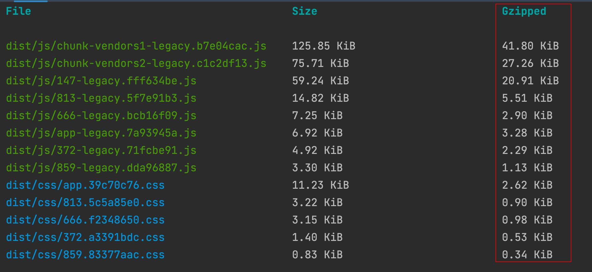
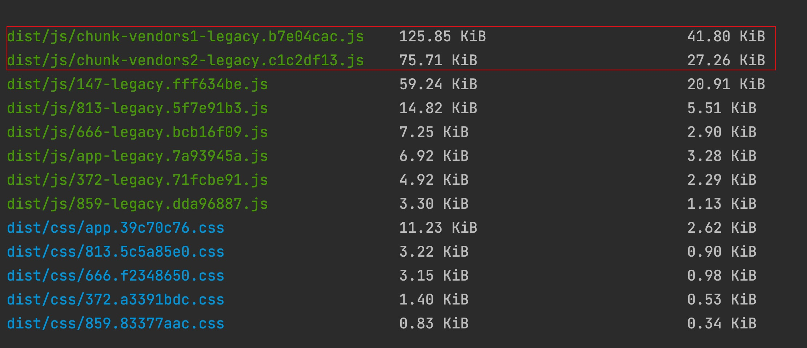
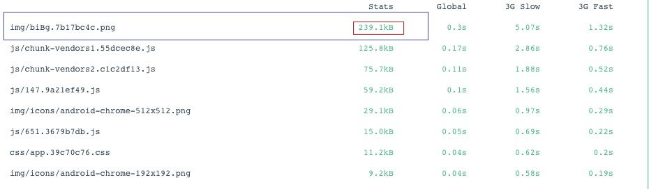
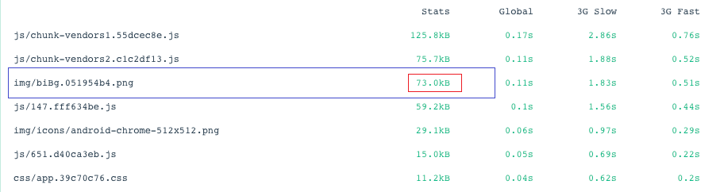

### 功能
```
  -打包开启gzip压缩
  -打包分离公共代码
  -打包压缩图片
  -组件按需加载 
  -全局scss变量
  -移动端布局（pxtorem）
  -axios请求API封装
  -常用工具函数（节流，防抖，深克隆等）
  -service worker离线缓存
  -后续还会添加更多功能
```

### 打包压缩gzip
  首先安装 compression-webpack-plugin
```
yarn add compression-webpack-plugin -D (开发依赖)
```  
  然后在vue.config.js文件中添加以下代码开启
```javascript
const CompressionWebpackPlugin = require("compression-webpack-plugin");
module.exports = defineConfig({
  configureWebpack: (config) => {
    if (isProduction) {
      config.plugins.push(new CompressionWebpackPlugin()); //开启gzip
    }
  },
});
```
  随后在命令行运行 
```
yarn build
```
  可以看到打包已经产出了gzip格式的文件，比原文件体积压缩了有百分之60以上。



### 打包分离公共代码
在vue.config.js文件中添加一下代码
```javascript
module.exports = defineConfig({
  configureWebpack: (config) => {
    config.optimization = {
      splitChunks: {
        cacheGroups: {
          vendors1: {
            name: "chunk-vendors1",
            test: /[\\/]node_modules[\\/](vue|vant)/, // 把vue,vant打包在一起
            priority: 20,
            chunks: "initial",
          },
          vendors2: {
            name: "chunk-vendors2",
            test: /[\\/]node_modules[\\/]/, // 余下的三方库打包在一起
            priority: 10,
            chunks: "initial",
          },
        },
      },
    };
  },
});
```
查看效果



### 打包压缩图片
首先安装 image-webpack-loader
```
yarn add compression-webpack-plugin -D (开发依赖)

```  
如果遇到打包失败（网速原因东西下载不完整导致）就使用cnpm安装
```
cnpm i image-webpack-loader -D
```
然后在vue.config.js文件中添加以下代码开启
```javascript
module.exports = defineConfig({
  chainWebpack: (config) => {
    config.module
      .rule("images")
      .test(/\.(png|jpe?g|gif)(\?.*)?$/)
      .use("image-webpack-loader")
      .loader("image-webpack-loader")
      .options({ bypassOnDebug: true })
      .end();
  },
});
```
随后在命令行运行
```
yarn build
```
可以看到打包产出了图片文件体积，比原文件体积压缩了有百分之70以上。<br/>
`压缩前`

`压缩后`


### 组件按需加载

> 作用：为了防止首页加载文件过大，导致长时间白屏，影响用户体验

```
{
    path: "/rank",
    name: "ranking",
    component: () => import("../views/Home/components/Ranking.vue"), // 按需加载引入组件
    meta: {
      keepAlive: true,
    },
}

```

### 全局scss变量
> 作用：定义好全局主题色，加快开发速度

首先安装style-resources-loader

```
yarn add style-resources-loader -D  // 开发依赖

```

然后在vue.config.js中添入一下代码

```
module.exports = defineConfig({
  pluginOptions: {
    "style-resources-loader": {
      preProcessor: "scss",
      patterns: [path.resolve(__dirname, `./src/style/theme/index.scss`)],
    },
  },
});

```

使用方法：<br>
index.scss内容
```scss
$theme: #c44f41;

```
其他vue文件中，可以直接使用index.scss定义的内容，不需要引入scss文件，如下所示

```scss
<style lang="scss" scoped>
.test {
  color: $theme;    
}
</style>
```

### 移动端布局（pxtorem）


